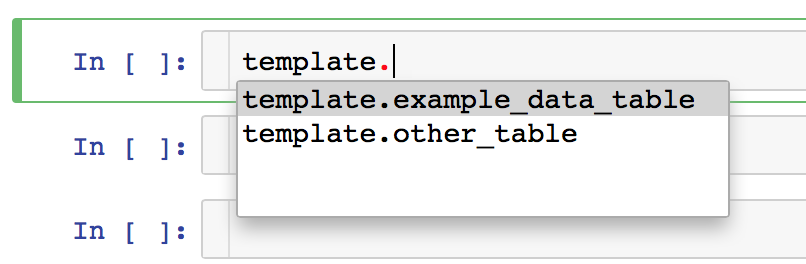

# jupyter-notebook-template

The goal of this repository is to serve as a template for any new projects to avoid the hassle of configuring all the options each time a new project is started. The file notebook_initializer.ipynb serves as a starting point for any Jupyter notebook by importing useful libraries and setting up default settings (e.g., plotting settings, SQL magic functions).

## Files
### Notebooks
- `notebook_initializer.ipynb`: This notebook is a template for any new notebook. It should be copied when creating a new notebook so that all of the libraries are already typed in along with any changes to the default matplotlib settings and magic commands to interact with SQL. Alternatively, we can simply 'source' this notebook from another Jupyter notebook by running `%run notebook_initializer.ipynb`. This helps us keep the main notebook cleaner by having fewer cells.

### Python Files
- `credentials.py`: This file includes login information into an MPP database. It is important to keep these separate from the notebook so that login information is not present inside of the notebook.

### Submodules
- `python-utils`: A repository containing utility functions for common machine learning tasks such as plotting, manipulating data, and accessing a SQL database.

- `mpp-plotting`: A repository containing functions for plotting using an MPP database. For more info, check out my [blog post](http://engineering.pivotal.io/post/mpp-plotting/).

## Examples
We now show some examples of how to use these magic functions.
### Executing SQL Queries
We can execute SQL commands simply by typing regular SQL code and putting an `%%execsql` at the very top of the cell.
```
%%execsql
DROP TABLE IF EXISTS example_data_table;
CREATE TABLE example_data_table
   AS SELECT random()
        FROM generate_series(1, 100);
```

### Reading SQL Query Outputs
We can also read SQL query outputs and store them into a pandas DataFrame by putting `%%readsql` at the top of the cell. This will output the DataFrame below the cell. It also stores it into a pandas DataFrame called `_df` by default.

```
%%readsql
SELECT *
  FROM example_data_table;
```

If the outputted DataFrame has too many rows, we can also look at the head by typing `%%readsql -h #` where `#` is an integer value. This will show the first `#` rows in the DataFrame, but store the entire DataFrame into `_df`.

```
%%readsql -h 10
SELECT *
  FROM example_data_table;
```

Additionally, if we wanted to store this table to a different DataFrame, we can include this at the end of the top line of the cell.

```
%%readsql -h 10 other_df
SELECT *
  FROM example_data_table;
```

One final possibility is to use string formatting. Suppose we have the name of the table as a variable in Python.

```
table_name = 'example_data_table'
```

We can then select use this variable in our SQL query string.

```
%%readsql -h 10 other_df
SELECT *
  FROM {table_name};
```

### Printing SQL Queries
While writing our SQL queries with string formatting, we may want to view the query beforehand as it there may be errors. We want to do this via the `%%printsql` magic function.

```
%%printsql
SELECT *
  FROM {table_name};
```

### Autofill Table Names
When tables are created, the `refresh_tables` function is run. This will place the table name in the namespace as a string. This will give us tab completion for our table names.



### Threading/Background Processes
Threading allows us to run two or more cells concurrently. This is useful if we have a long query running, but want to test other stuff inside of the same notebook and use the same variables. We make use of the `%%background` magic function to execute a cell in the background. The magic function will micro-manage these processes by assigning them with IDs. If IDs are not descriptive enough in identifying what the code is doing, there is also an option to append a comment to the thread.

A simple background thread being called:

```
%%background
some_code_here
```

A background thread with a comment:

```
%%background comment text goes here
some_code_here
```

We can also separate a cell of code into separate sections, which will individually run in parallel in the background. We do this using lines that begin with two or more '#' characters. Any following characters in the line go towards the thread's comment.
```
%%background Multi-thread
## First thread
some_code_here
## Second thread
some_other_code_here
```

The notebook will automatically create a `ThreadManager` called `thread_manager`, which is what the `%%background` magic function accesses. We can view all current and past threads by calling the `thread_manager`.

```
thread_manager()
```

This returns a DataFrame showing all completed and uncompleted threads. It also displays their start and end times, the total time for the code to run, and the comment. If there was an error in the code, then it will display that instead of the end time and completion time.

We can also filter and show only finished or unfinished threads by running:

```
thread_manager.get_finished_threads()
thread_manager.get_unfinished_threads()
```

Again, these return DataFrames.
